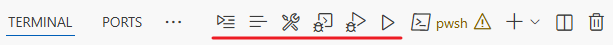
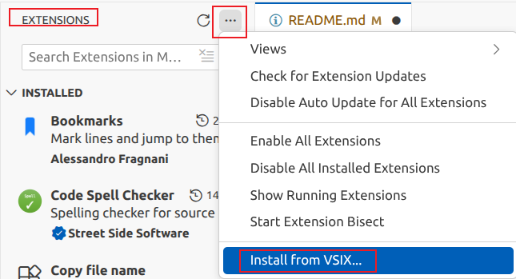

# Button in Terminal Panel

A VSCode extension: Add buttons in terminal panel, like build and debug buttons.

The current implementation adds 6 buttons: 3 task/build buttons + 3 run/debug buttons, placed to the left of the default buttons:



Button functions and commands:
| Button | Command |
|--------|---------|
| Select & Run task             | `workbench.action.tasks.runTask` |
| Configure default build task  | `workbench.action.tasks.configureDefaultBuildTask` |
| Run default build task        | `workbench.action.tasks.build` |
| Select & Debug program        | `workbench.action.debug.selectandstart` |
| Debug program                 | `workbench.action.debug.start` |
| Run program without debugging | `workbench.action.debug.run` |

## Install

1. Get .vsix file in [Release](https://github.com/CharlesLiaoO/VscExt_ButtonInTerminalPanel/releases)
2. In Extension view, click the triple-dot button, then 'Install from VSIX...'



## Modify Buttons

The terminal panel title bar buttons cannot be customized via setting.json files. To change buttons, you must modify this project’s code. The changes are straightforward. A example below shows how to add button 7.

### 1. Add a button definition in `src/extension.ts`

Add to `const BUTTON_DEFINITIONS: ButtonDefinition[]`:

```typescript
{ id: 'button6', command: '<A New Button Command>' },
```

### 2. Register the command in `package.json`

Add to the `contributes.commands` array:

```json
{
  "command": "button-in-terminal-panel.button6",
  "title": "Your Button Title",
  "category": "Button in Terminal Panel",
  "icon": "$(your-icon)"
}
```

VS Code icon references:
- https://code.visualstudio.com/api/references/icons-in-labels
- https://microsoft.github.io/vscode-codicons/

### 3. Add a menu item in package.json

Add to the `contributes.menus.view/title` array:

```json
{
  "command": "button-in-terminal-panel.button6",
  "when": "view == terminal",
  "group": "navigation@-7"
}
```

Adjust Button Order:

Modify the `group` value in `menus.view/title` inside package.json:

- `navigation@-99` to `navigation@-1`: to the **left** of the terminal default buttons
- `navigation@0` to `navigation@99`: to the **right** of the terminal default buttons
- Smaller numbers place the button further left

### 4. Build

Dependencies: Node.js/npm, download in https://nodejs.org/en/download, tested version: 24; tested OS: Ubuntu 22.04

Build steps:
```bash
# 1. Install dependencies
npm install

# 2. Compile (this can also be triggered by the packaging command)
npm run compile

# 3. Debug (optional)
# In the new window, open the terminal to view the buttons

# 4. Package
npm run package

# 5. Install the produced .vsix file
```


## License

MIT
